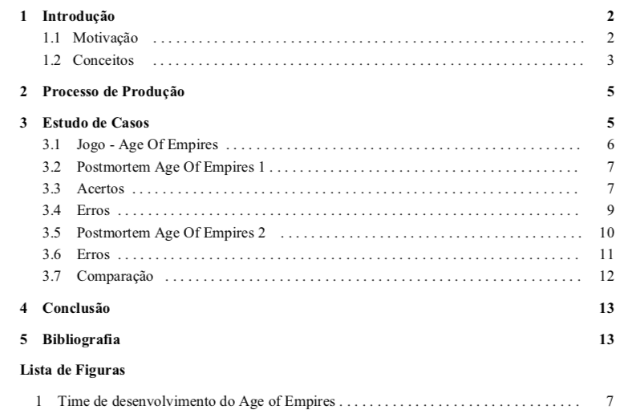

# aoe-postmortem

OVERVIEW
--------------------------------------------------
The purpose of this project was to make a Postmortem of a game in monograph format for the [Game Development] course, there was also a presentation. The chosen game was Age of Empires. It was made at the Computer Science undergraduate program from University of São Paulo (ICMC - USP).

WHAT IS A POSTMORTEM?
--------------------------------------------------
A postmortem project is a process, usually undertaken after the completion of a project, to determine and analyze elements of a project that was successful or unsuccessful. Postmortem projects aim to inform improvements in the development process that reduce future risks and promote good project practices. Postmortem are often considered a key component of risk management.

CREDITS
--------------------------------------------------
- André Miguel Coelho Leite
- Andreas Munte Foerster
- Guilherme Muzzi da Rocha
- Rafael Gallo
- Wesley Tiozzo

This project has academic purposes only.

MORE INFO
--------------------------------------------------
You can find the whole project in the files: `monography.pdf` and `presentation.pptx`
